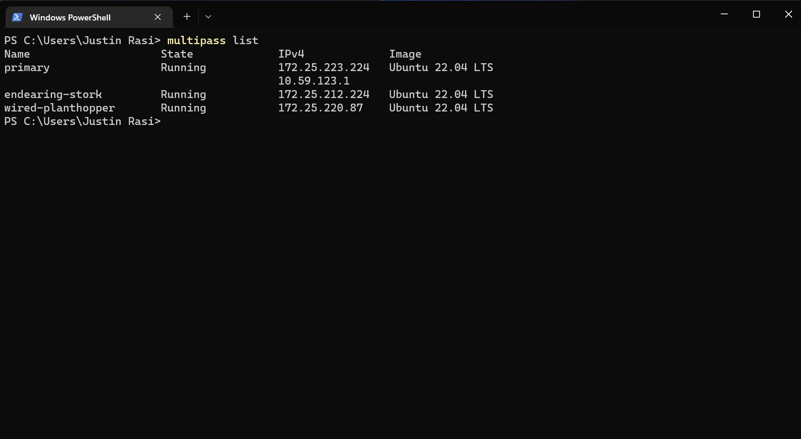
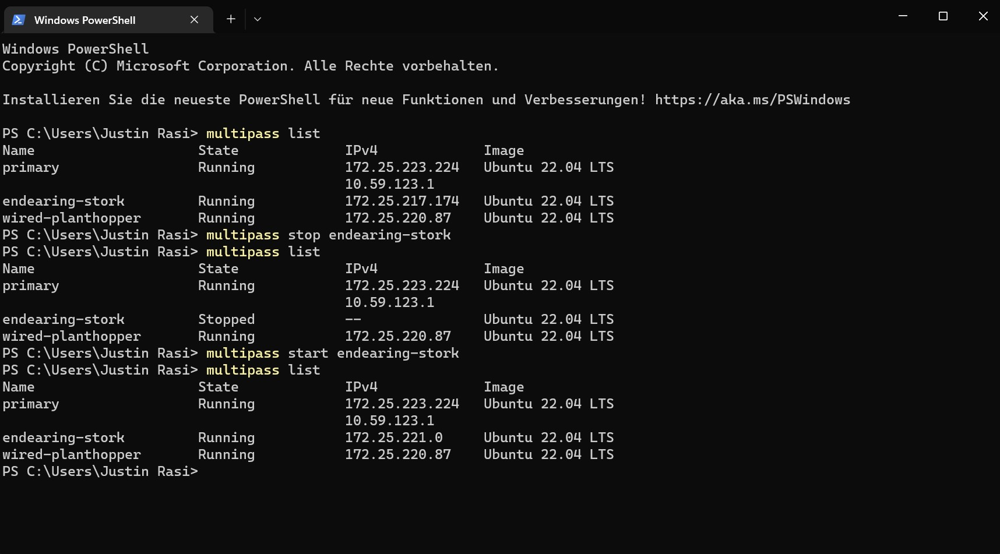
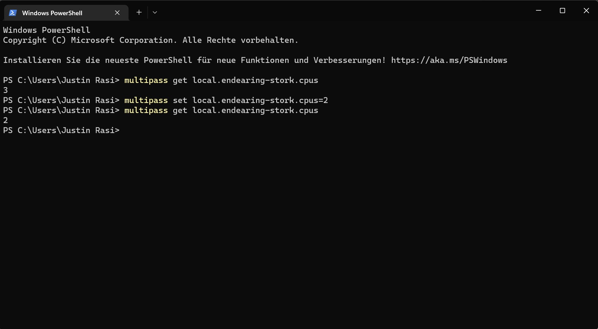
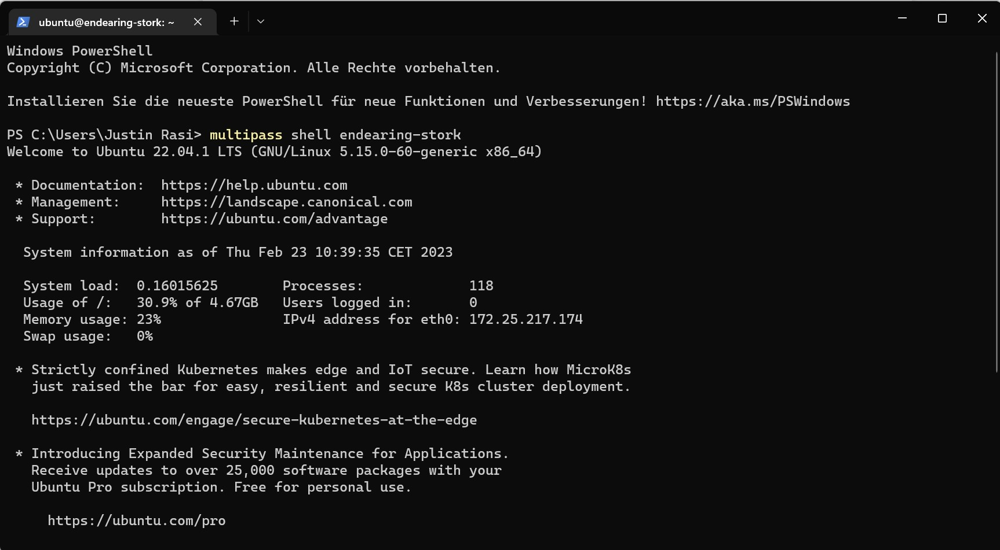
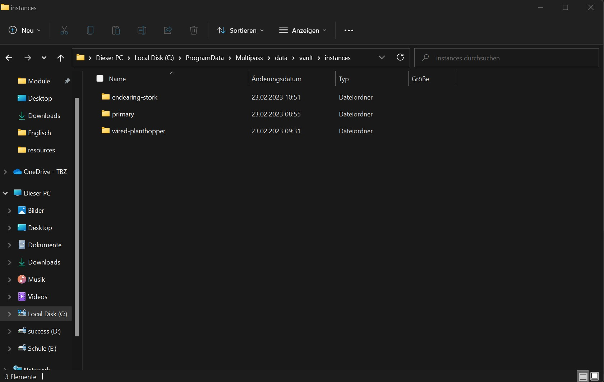
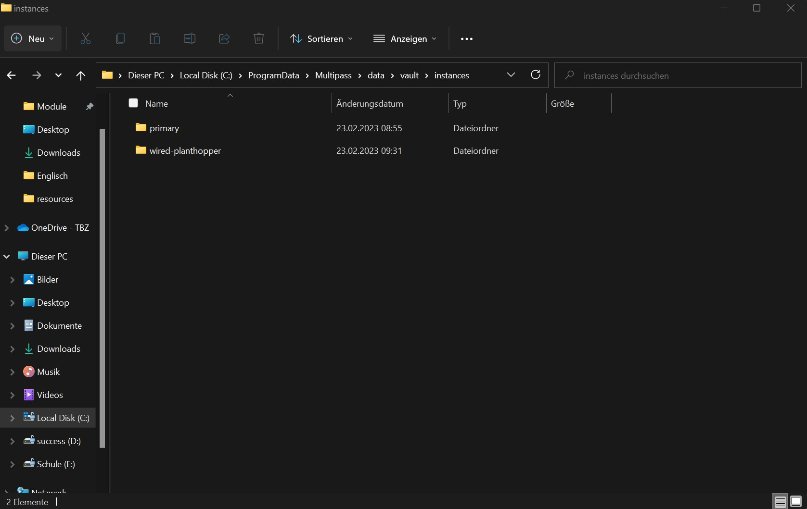
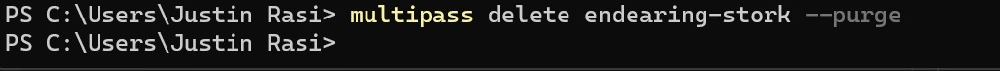
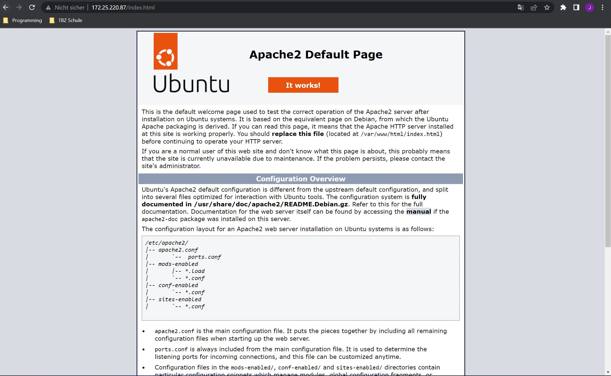
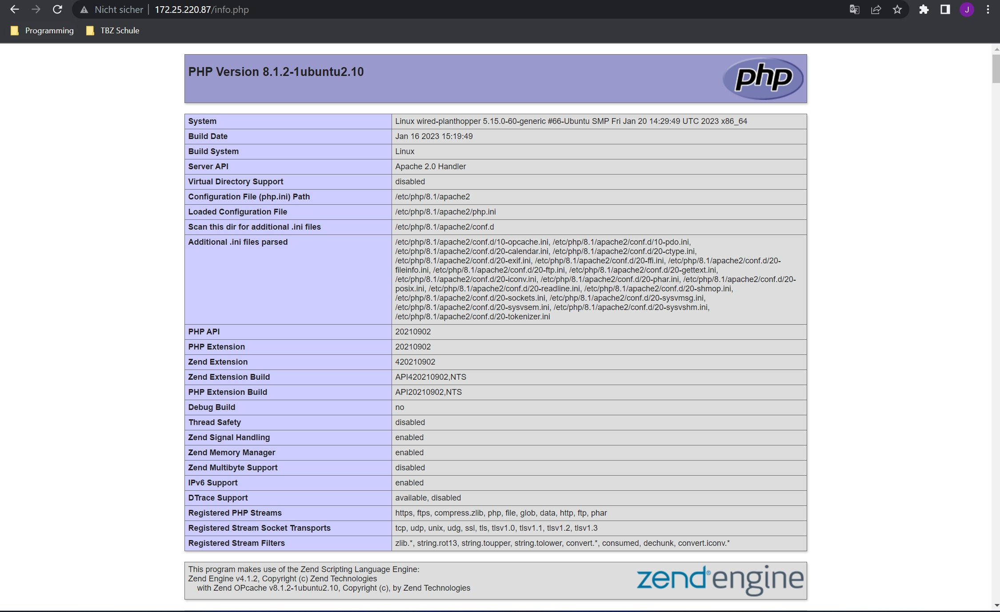
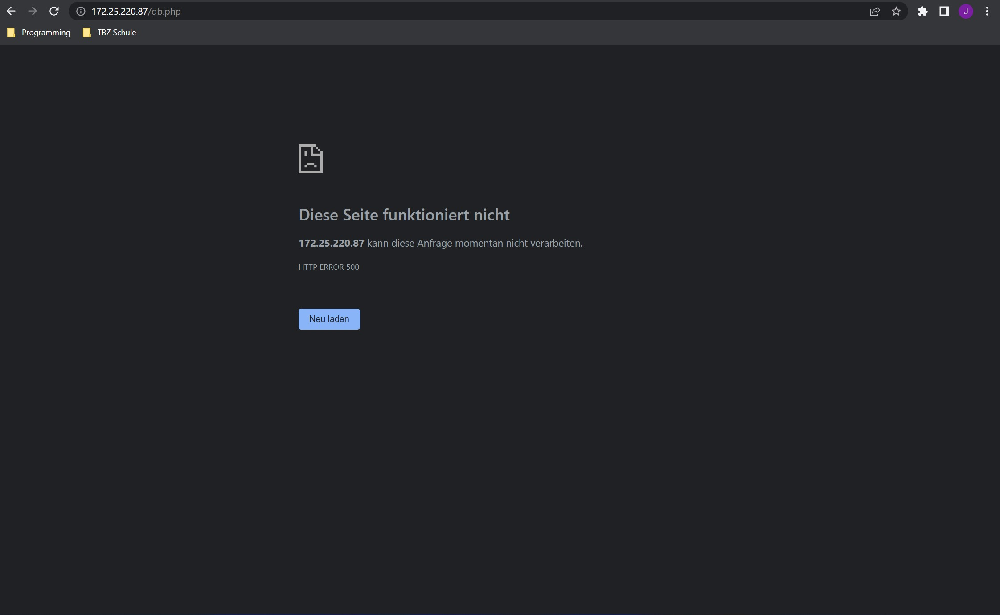

# KN01 : Virtualisierung

## Aufgabe B - Erstellen Sie ihre erste VM
#### UI

#### Console

## Aufgabe C - Testen Sie verschiedene Befehle

### Starten und Stoppen Sie die Instanz via Command Line (Konsole)

#### Ändern Sie die Anzahl CPU der Instanz

#### Rufen Sie die Shell der Instanz auf (Linux Bash)

#### Löschen Sie eine Instanz (permanent!). Zum zeigen, dass die Instanz gelöscht wurde, können SieScreenshots des Dateisystems erstellen.

##### vorher

#### nachher

#### command

## Aufgabe D - Installation von Web- und Datenbankserver

#### Index HTML

#### Info PHP

#### DB PHP

