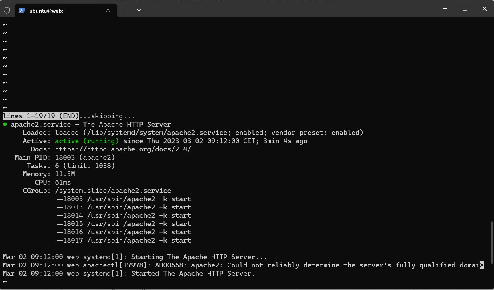
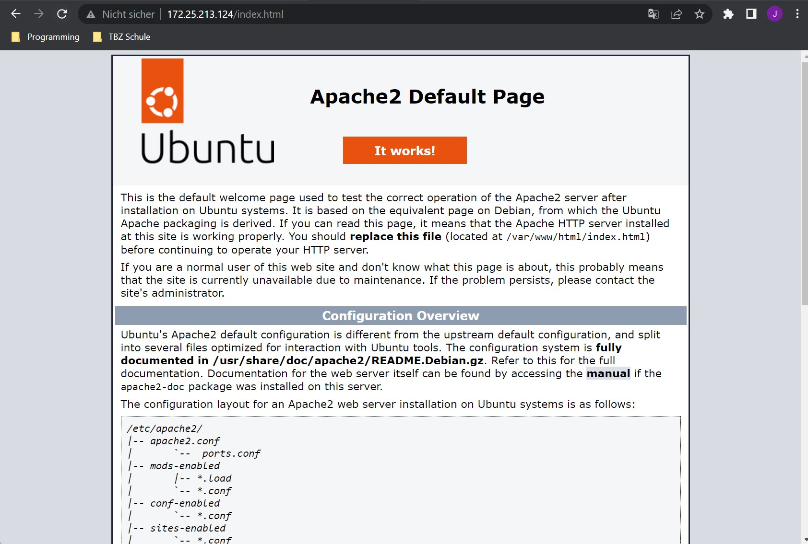
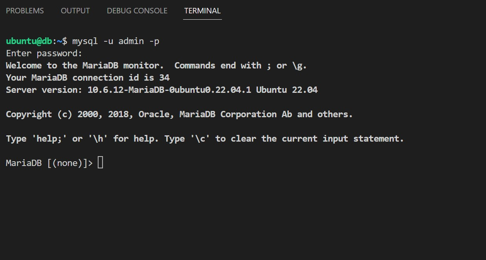
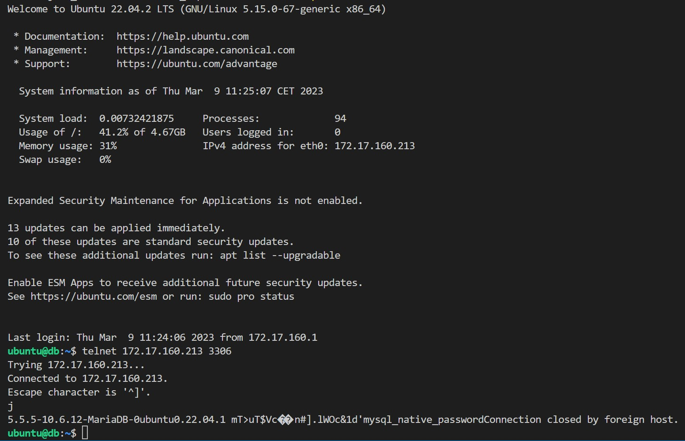
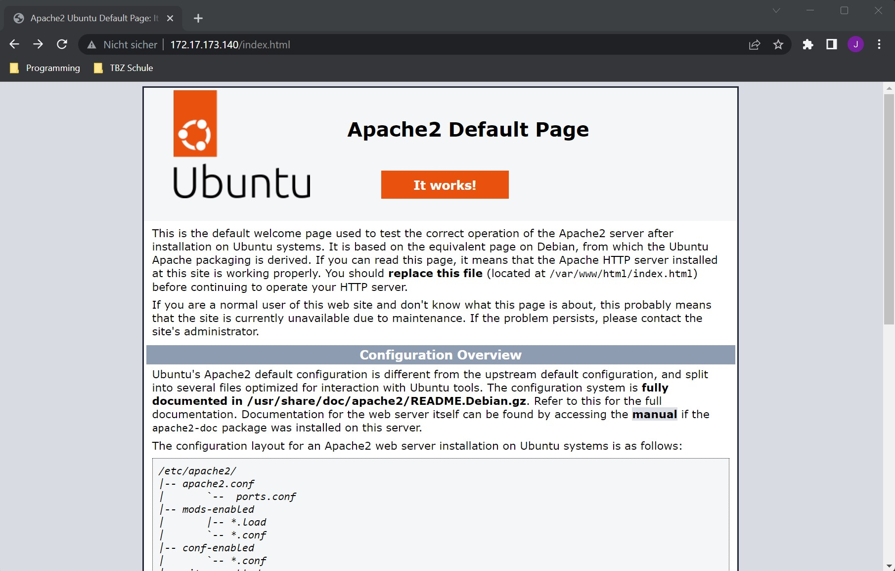
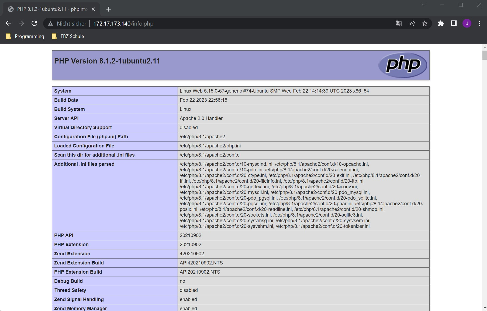
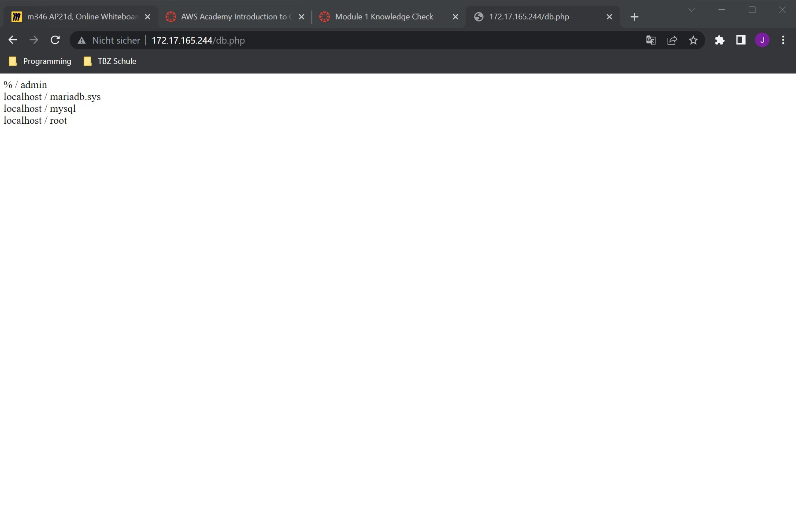
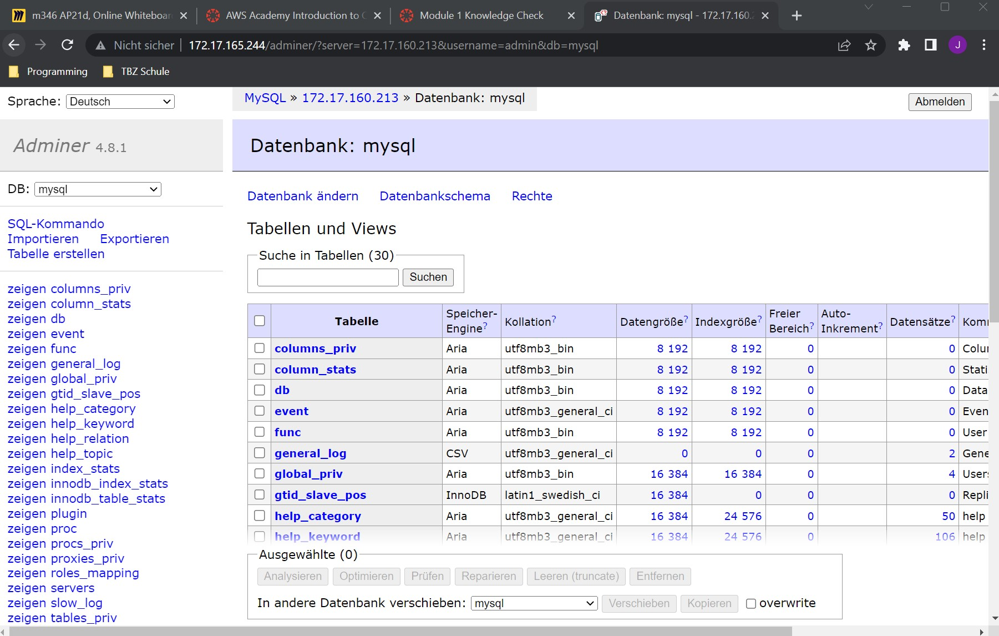

# KN02 : Automatisierung / Cloud-init

## Aufgabe A - Cloud-init Datei Verstehen

#cloud-config
users: # Collection von Benutzern
  - name: ubuntu # Erster Benutzername
    sudo: ALL=(ALL) NOPASSWD:ALL # sudo-Regeln für den Benutzer
    groups: users, admin # Gruppen die dem Benutzer zugeordnet sind
    home: /home/ubuntu # Homeverzeichnis vom Benutzer
    shell: /bin/bash # Shellverzeichnis vom Benutzer
    lock_passwd: false # Aktiviert Passwort Login
    plain_text_passwd: 'password' # Passwort ohne Verschlüsselung
ssh_pwauth: true # Authentifizierung mit SSH
disable_root: false 
packages: # Collection von Paketen
  - apache2 # Paket apache2
  - curl # Paket curl
  - wget # Paket wget
  - php # Paket php
  - libapache2-mod-php # Paket libapache2-mod-php
  - php-mysqli # Paket php-mysqli

## Aufgabe B - Cloud-init Datei verwenden

## Aufgabe C - Cloud-init Datei ändern und erstellen

#### Datenbankserver

#### Webserver

