## AWS Kurs
#### Lab 4.1 - EC2
Hier sieht man die index.html Seite, aufgerufen im Browser.
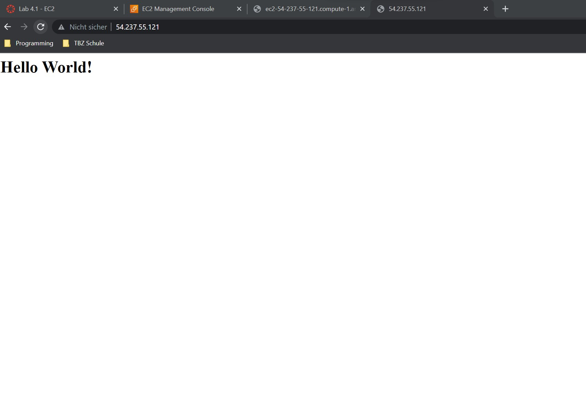
Hier sieht man die Instanzen, die existieren.
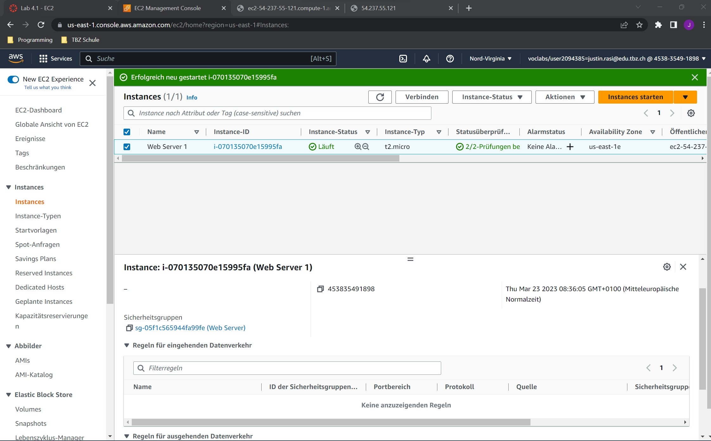
Hier sieht man die Details der Instanz, hier sind Informationen wie z.B. die öffentliche IP sichtbar.
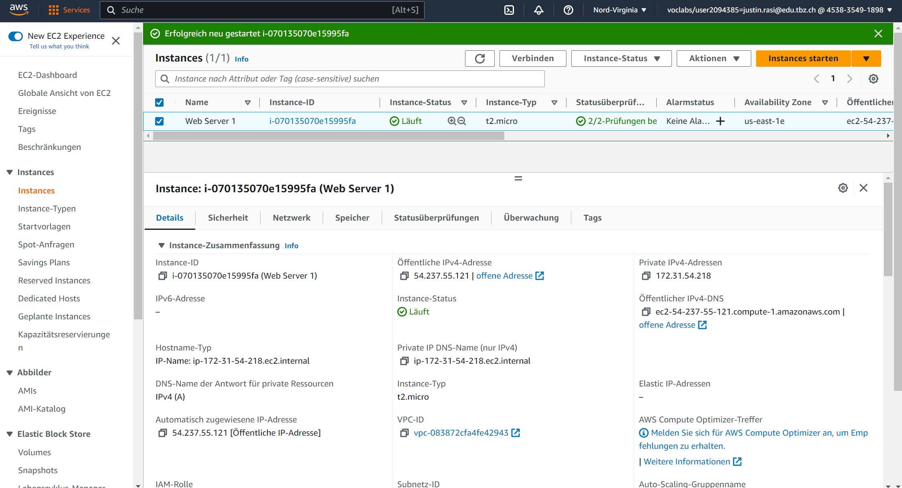
Hier sieht man die Inbound Rule, diese bestimmt, wie man auf die Instanz connecten kann.
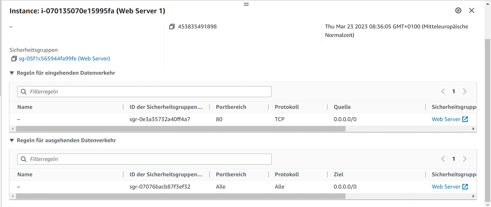
#### Lab 4.2 - S3
Hier sieht man die vorhandenen Buckets.
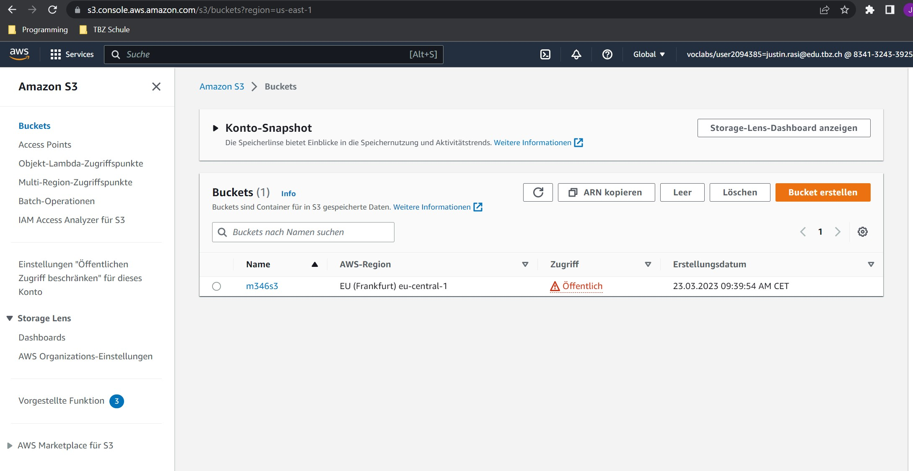
Hier sieht man index.html Aufruf, nachdem index im Bucket gespeichert wurde.
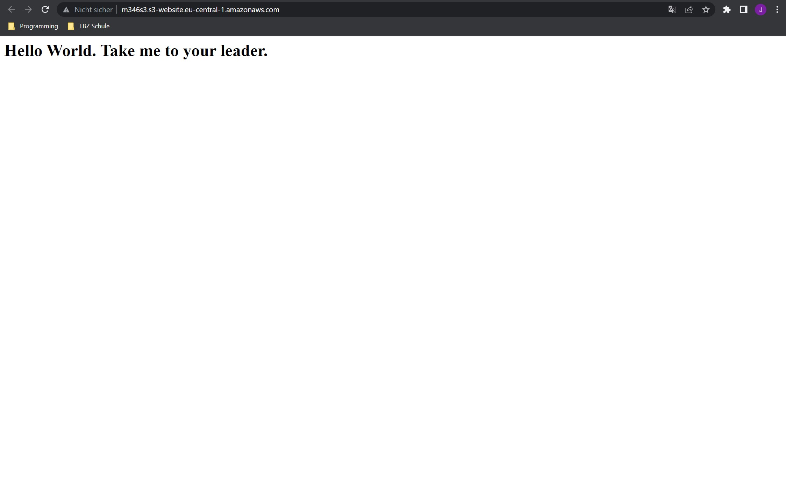
Hier sieht man Alle Objekte (Dateien), die im Bucket gespeichert sind.
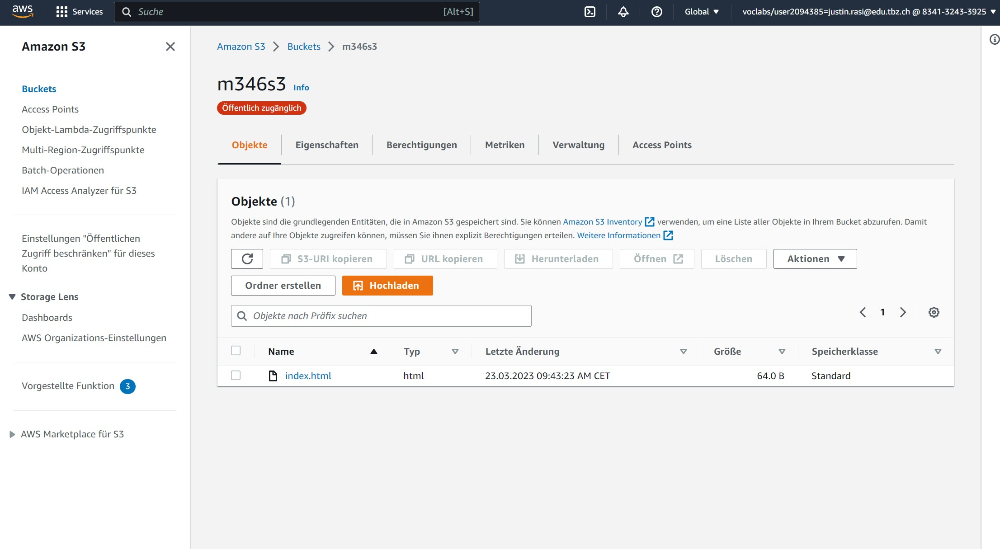
Hier sieht man die Hosten einer statischen Website Einstellungen.
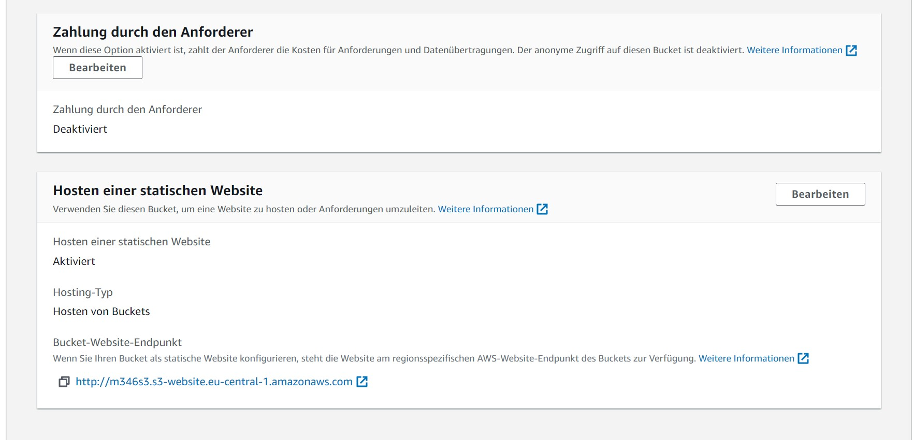

#### Zugriff mit SSH-Key
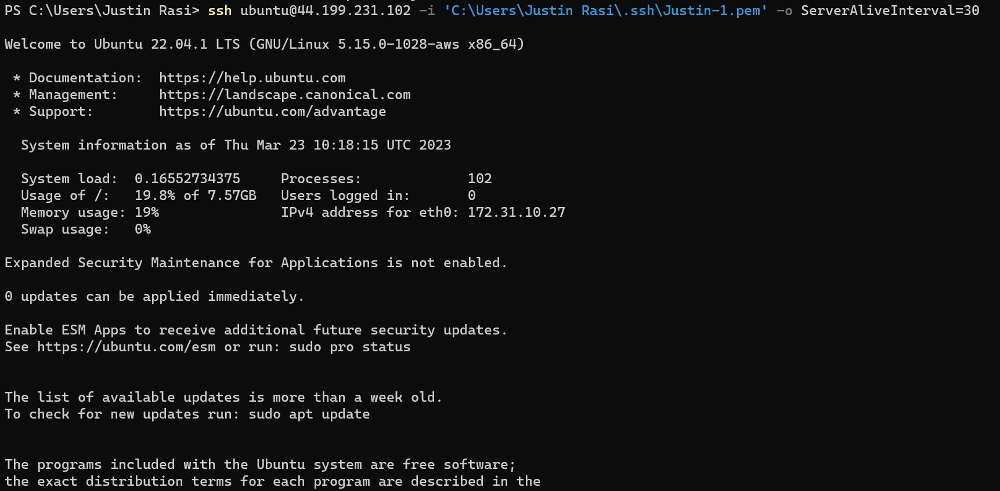

#### SSH-Key und Cloud-init

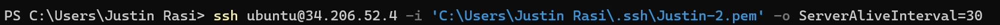
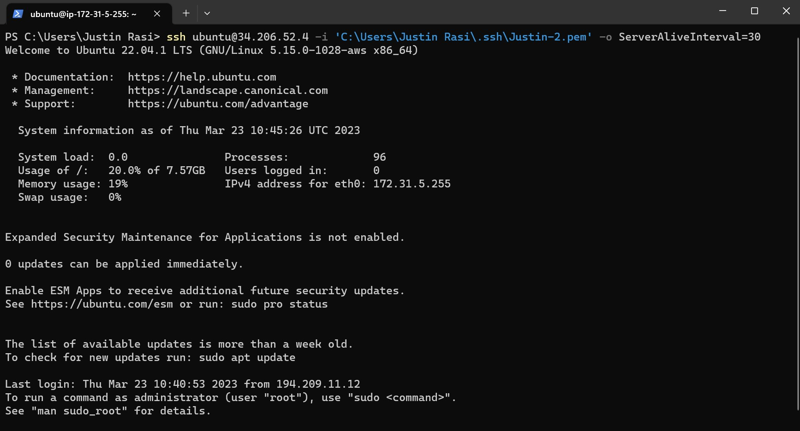