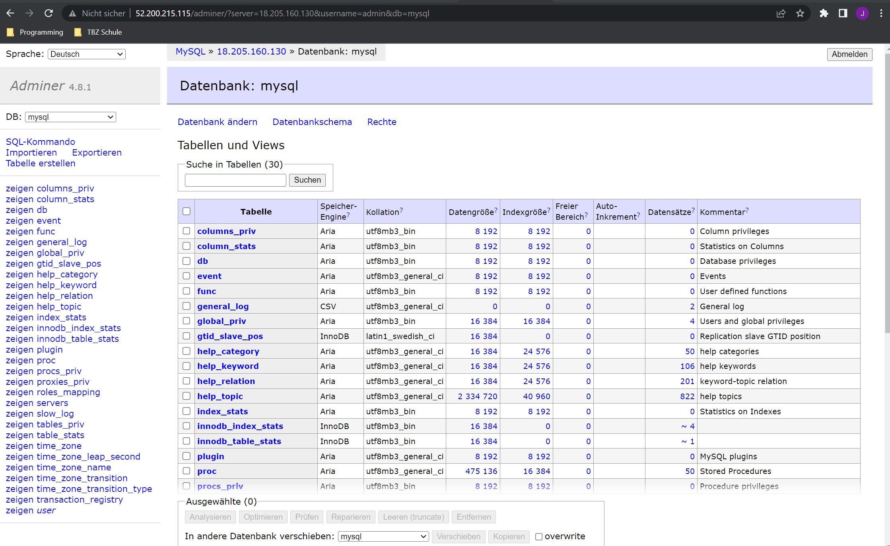
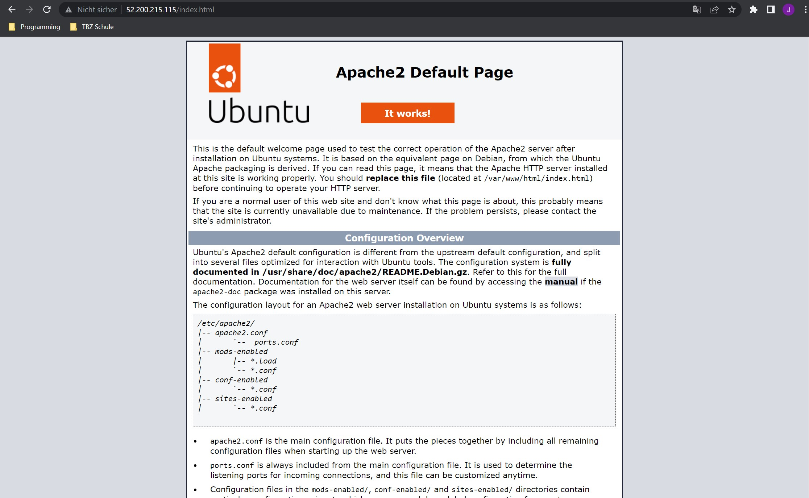
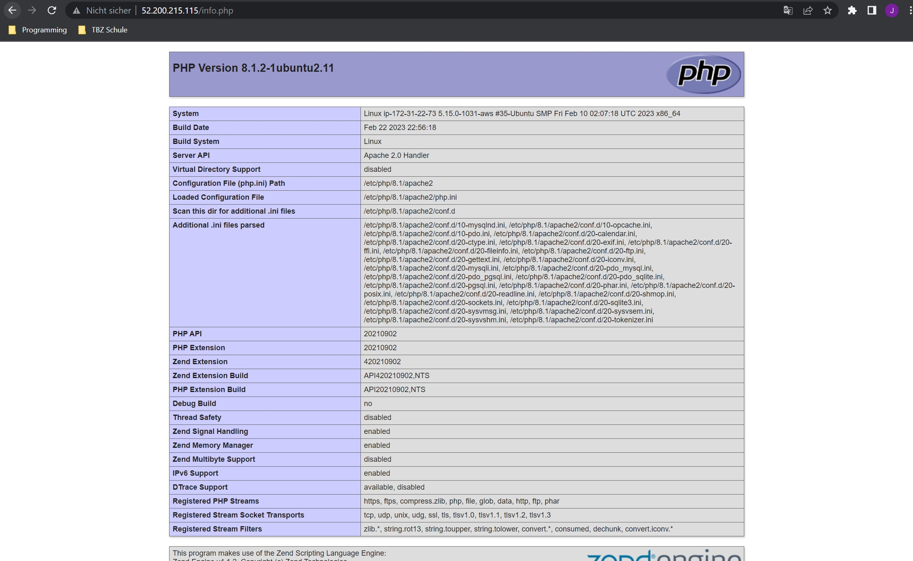
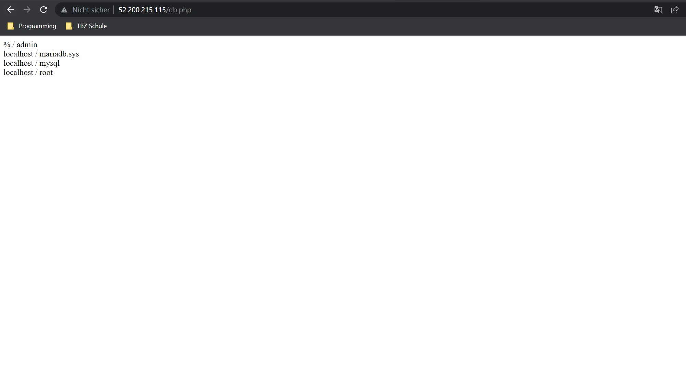
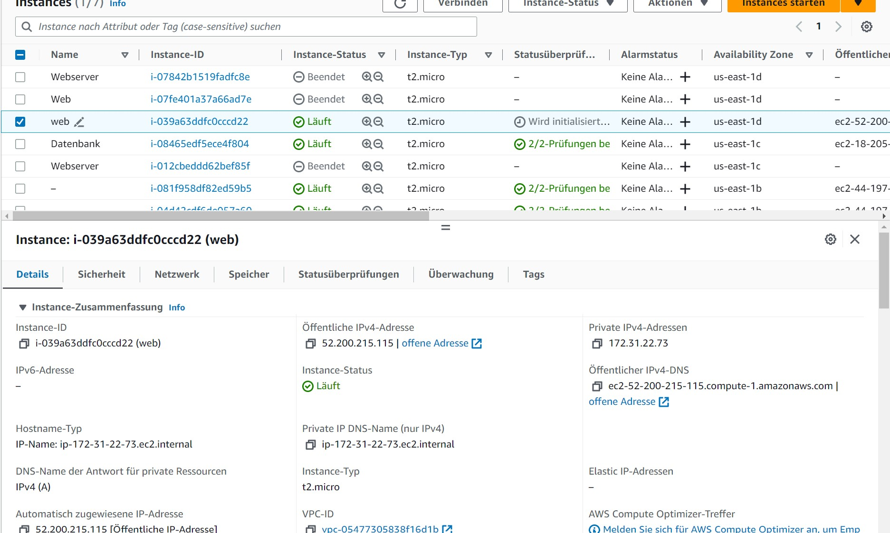
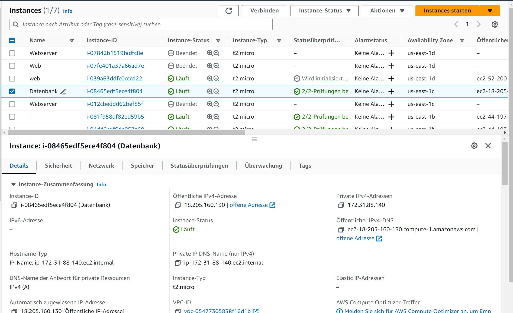
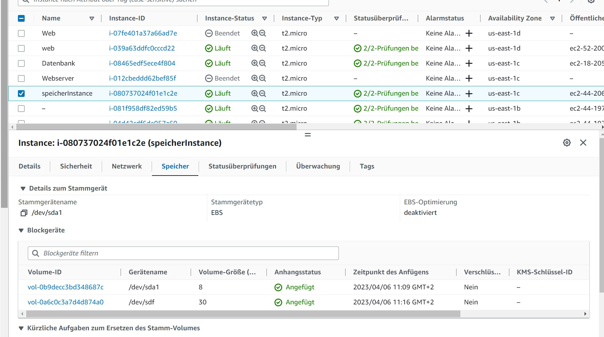
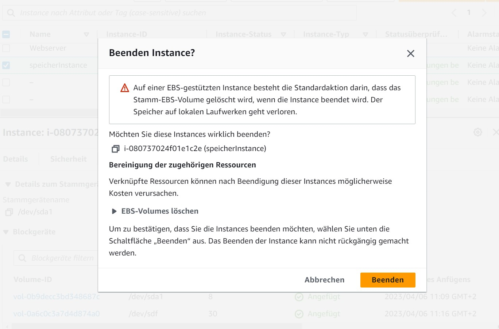

## Portierung von Multipass zu AWS

### Webserver cloud-init
    #cloud-config
    users:
    - name: ubuntu
        sudo: ALL=(ALL) NOPASSWD:ALL
        groups: users, admin
        home: /home/ubuntu
        shell: /bin/bash
        lock_passwd: false
        plain_text_passwd: 'password'        
    ssh_pwauth: true
    disable_root: false 
    packages:
    - apache2 
    - curl 
    - wget 
    - php 
    - libapache2-mod-php 
    - php-mysqli
    - adminer
    write_files:
    - path: /var/www/html/info.php
        permissions: '0644'
        content: |
        <?php
            // Show all information, defaults to INFO_ALL
            phpinfo();
        ?>
    - path: var/www/html/db.php
        permissions: '0644'
        content: |
        <?php
            //database
            $servername = "18.205.160.130";
            $username = "admin";
            $password = "password";
            $dbname = "mysql";

            // Create connection
            $conn = new mysqli($servername, $username, $password, $dbname);
            // Check connection
            if ($conn->connect_error) {
                    die("Connection failed: " . $conn->connect_error);
            }

            $sql = "select Host, User from mysql.user;";
            $result = $conn->query($sql);
            while($row = $result->fetch_assoc()){
                    echo($row["Host"] . " / " . $row["User"] . " ");
            }
            //var_dump($result);
        ?>
    runcmd:
    - sudo a2enconf adminer
    - sudo systemctl restart apache2

### DB cloud-init

    #cloud-config
    users:
    - name: db
        sudo: ALL=(ALL) NOPASSWD:ALL
        groups: users, admin
        home: /home/ubuntu
        shell: /bin/bash
        lock_passwd: false
        plain_text_passwd: 'password'
    ssh_pwauth: true
    disable_root: false 
    packages:
    - mariadb-server
    runcmd:
    - sudo mysql -stfu root  -e "GRANT ALL ON *.* TO 'admin'@'%' IDENTIFIED BY'password' WITH GRANT OPTION;"
    - sudo sed -i "s/127.0.0.1/0.0.0.0/g" /etc/mysql/mariadb.conf.d/50-server.cnf
    - sudo systemctl restart mariadb.service

### Adminer Screenshot

### index.html

### info.php

### db.php

### Details der beiden Instanzen

### Relevante Einstellungen der Instanz

## Speicher
a) S3 steht für Simple Storage Service" S3 ist ein Objektspeichermodell.

### Screenshot Instanz und Volumen

### Löschung der Instanz

Diese Nachricht informiert, dass die Instanz beendet wird. Bevor er dies tut, muss er sicherstellen, dass er die damit verbundenen Ressourcen bereinigt. Andernfalls können diese Ressourcen auch nach dem Beenden der Instanz Kosten verursachen.

### Wieso existiert Volumen noch?
Es existiert noch, weil es ein externes Volume ist.